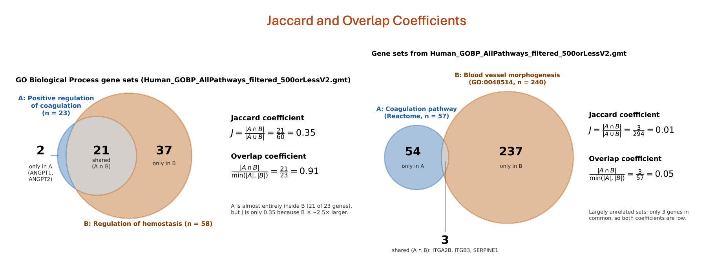

# Defined genelist {-}

**This work is licensed under a [Creative Commons Attribution-ShareAlike 4.0 Unported License](https://creativecommons.org/licenses/by-sa/4.0/deed.en). This means that you are able to copy, share and modify the work, as long as the result is distributed under the same license.**

Authors: Veronique Voisin, Ruth Isserlin 

Presenter: Veronique Voisin

## Introduction

During this practical lab, we will perform pathway enrichment analysis using a defined gene list.

## Goal of the exercise 1

For this exercise, our goal is to run pathway enrichment analysis using g:Profiler and explore the results.
g:Profiler performs a gene-set enrichment analysis using a hypergeometric test (Fisher’s exact test). The [Gene Ontology](http://geneontology.org/) Biological Process, [Reactome](https://reactome.org/) and [WikiPathways](https://www.wikipathways.org/) sources are going to be used as pathway databases. 
We wil also upload our custom geneset file.

g:Profiler can be used using the website at https://biit.cs.ut.ee/gprofiler/gost. However, for this practical lab, we will run it from the g:Profiler R package.

We will run the query and explore the table of results and visualize the results as bar and dot plots.

One of the greatest features of [g:Profiler](https://biit.cs.ut.ee/gprofiler/gost) is that it is updated on a regular basis and most of the previous versions are available online ont the [gprofiler archive](https://biit.cs.ut.ee/gprofiler/page/archives).

The [gprofielr2](https://biit.cs.ut.ee/gprofiler/page/r) -[g:Profiler](https://biit.cs.ut.ee/gprofiler/gost) R implementation is a wrapper for the web version.  You require an internet connection to get enrichment results.  


## Data

g:Profiler requires a list of genes. For this analysis, we used genes we found to be differentially expressed in palbociclib-resistant samples compared with parental samples from the breast cancer cell line MCF7 (see chapter 1.

## Exercise 1 - prepare the gene lists {#exercise-1-defined}

This exercise requires the file "edgeR_resistant_vs_parental_all_genes.csv" located in the results folder.


### Step 1 - Install and Load libraries
```{r message=FALSE, warning=FALSE}
# List of CRAN packages
cran_packages <- c(
  "tidyverse",
  "knitr",
  "kableExtra",
  "glue",
  "patchwork",
  "ggdendro",
  "pheatmap",
  "gprofiler2",
  "GSA"
)
# Install CRAN packages if not already installed
for (pkg in cran_packages) {
  if (!requireNamespace(pkg, quietly = TRUE)) {
    install.packages(pkg)
  }
}
# Load the libraries
library(tidyverse)
library(knitr)
library(kableExtra)
library(glue)
library(patchwork)
library(ggdendro)
library(pheatmap)
library(gprofiler2)
library(GSA)

# create the results folder (if it does not exist yet) to save the outputs
dir.create("results", showWarnings = FALSE)
```


### Step 2 - Prepare the define gene lists
```{r}
res = read.csv("results/edgeR_resistant_vs_parental_all_genes.csv")

UPgenes <- res$gene[res$logFC>0 &  res$FDR <= 0.001]
DOWNgenes <- res$gene[res$logFC<0 &  res$FDR <= 0.001]

```


### Step 3 - Run g:Profiler
The next step is to run pathway enrichment analysis using [gost g:Profiler](https://biit.cs.ut.ee/gprofiler/gost) using the g:Profiler2 R package.
For detailed descriptions of all the parameters that can be specified for the gost g:profiler function see the R package information - [here](https://cran.r-project.org/web/packages/gprofiler2/index.html) and [here](https://rdrr.io/cran/gprofiler2/man/gost.html).

For this query we are specifying - 

  * query - the set of genes of interest, as loaded in from the gene list file (`query_set`).
  * significant - set to FALSE because we want g:Profiler to return all the results not just the ones that it deems significant by its predetermined threshold. We will filter the results for significance in a next step.
  * ordered_query - set to FALSE (because we are not taking into account the order of the list)
  * exclude_iea - set to TRUE. We are removing the electronic inferred annotations from the GO database
  * correction_method - set to fdr.  by default g:Profiler uses g:Scs
  * organism - set to "hsapiens" for homo sapiens.  Organism names are constructed by concatenating the first letter of the name and the family name (according to gprofiler2 documentation)
  * source - the geneset source databases to use for the analysis.  We recommend using GO biological process (GO:BP), WikiPathways (WP) and Reactome (Reac) but there are additional sources you can add (GO molecular function or cellular component(GO:MF, GO:CC), KEGG, transcription factors (TF), microRNA targets (MIRNA), corum complexes (CORUM), Human protein atlas (HPA),Human phenotype ontology (HP) ) 

#### run g:Profiler with the up genes
```{r run gprofiler supplied gs}
query_set = UPgenes 

gprofiler_results_UPgenes <- gost(query = query_set ,
                          significant=TRUE,
                          ordered_query = FALSE,
                          exclude_iea=TRUE,
                          correction_method = "fdr",
                          organism = "hsapiens",
                          source = c("REAC","WP","GO:BP"))


```

#### observe the results
```{r}
#get the gprofiler results table
enrichment_results <- gprofiler_results_UPgenes$result

#display the names of all columns
colnames(enrichment_results)

#display the top rows
head(enrichment_results)

```

#### YOUR TURN: run g:Profiler with the down genes (use same parameters as above)
```{r, eval=FALSE}
##Tip: remove eval=FALSE chunk option to run the code
query_set = XXXX

gprofiler_results_DOWNgenes <- gost(query = XXXX,
                          significant = XXXX,
                          ordered_query = XXXX,
                          exclude_iea = XXXX,
                          correction_method = XXXX,
                          organism = XXXX,
                          source = c("XXXX","XXXX","XXXX"))

##observe the results (same as for the UP genes)
```


### Clear visualization of the results

The enrichment_results dataframe contains different columns. Let's rearrange the table to display the most important information. We will arrange the table so it contains: the database origin, the name of each of the pathway, term size , query size, intersection size and adjusted pvalue. - 

  * Term size: number of genes in the pathway as it is in the database
  * Query size: number of genes in our gene list
  * Intersection size: number of genes overlapping between our gene list and the tested pathway
  * pvalue: adjusted pvalue (corrected for multiple hypothesis testing using the Benjamini-Hochberg method)
  
The results are ordered by significance, from the most significant pathway (lowest p-value) to the least significant.

```{r}
enrichment_results <- gprofiler_results_UPgenes$result
enrichment_results$p_value <- formatC(enrichment_results$p_value, format = "e", digits = 2)

enrichment_results = enrichment_results[ , c("source", "term_name", "term_size", "query_size", "intersection_size", "p_value")]

kable(head(enrichment_results, n=20), caption = "Enrichment Result") %>%
kable_styling(bootstrap_options = c("striped", "condensed"), font_size = 10)
```

#### YOUR TURN: visualize the results with the down genes (use same parameters as above)
```{r, eval=FALSE}
##Tip: remove eval=FALSE chunk option to run the code

enrichment_results <- XXXX
enrichment_results$p_value <- formatC(XXXX)

enrichment_results = enrichment_results[ , c("XXXX", "XXXX", "XXXX", "XXXX", "XXXX", "XXXX")]

kable(head(enrichment_results, n=20), caption = "Enrichment Result") %>%
kable_styling(bootstrap_options = c("striped", "condensed"), font_size = 10)

```

### Step 4 - Explore top table of results

For this analysis, we chose to use 3 databases: GO:BP, Reactome and Wikipathways. 
If we look at the top table only, we are only going to see the results of GO:BP but it is interesting to look at the top results for each of the 3 databunique(enrichment_results$source)

```{r}
enrichment_results <- gprofiler_results_UPgenes$result
##Get the name of the databases
unique(enrichment_results$source) 

##Filter the dataframe to retrieve only the Reactome results
enrichment_results_Reac <- enrichment_results %>%
  filter(source == "REAC")

##Now display the top 20 pathways
kable(head(enrichment_results_Reac, n=20), caption = "Enrichment Result") %>%
kable_styling(bootstrap_options = c("striped", "condensed"), font_size = 10)
                                                  
```

#### YOUR TURN:  DISPLAY THE TOP 20 PATHWAYS FOR THE WIKIPATHWAY DATABASE ("WP") and the down genes
```{r, eval=FALSE}
enrichment_results <- gprofiler_results_DOWNgenes$result
##Get the name of the databases
unique(enrichment_results$source) 

##Filter the dataframe to retrieve only the Reactome results
enrichment_results_WP <- enrichment_results %>%
  XXXX(source == "XXXX")

##Now display the top 20 pathways
kable(head(enrichment_results_WP, n=20), caption = "Enrichment Result") %>%
kable_styling(bootstrap_options = c("striped", "condensed"), font_size = 10)
                                                  
```

### Step 5 - Filter results by geneset size

Restrict the results to just the ones that have at maximum gene-set size of 1000 and a minimum gene-set size of 10 and with an adjusted pvalue of 0.05.- 

  * maximum gene-set size of 1000: will remove very generic pathway terms that are less informative like "regulation of gene expression"
  * minimum gene-set size of 10: will remove small pathways where the pvalue is significant athough the overlap size is very small
  * p_thres: aim is to retrieve only pathways that are significant under this adjusted pvalue threshold of 0.01 (1% false positive)


```{r echo=TRUE}
enrichment_results <- gprofiler_results_UPgenes$result 

min_gs_size = 10
max_gs_size = 1000
p_thres = 0.01
# filter by params defined above
# by default we have set the max and min gs size to 250 and 3, respectively.


##the pvalue was stored as a character vector, we have to transform back into a numerical vector to be able to use it to filter values
enrichment_results$p_value <- as.numeric(enrichment_results$p_value) 

enrichment_results_mxgssize_1000_min_10_adjp_0_01 <- 
                        subset(enrichment_results,
                                   term_size >= min_gs_size & 
                                   term_size <= max_gs_size & 
                                   p_value <= p_thres )

#
myrows = nrow(enrichment_results_mxgssize_1000_min_10_adjp_0_01)

print(glue("It results in {myrows} selected pathways with maximum gene-set size of {max_gs_size} and minimum gene-set of {min_gs_size} with an adjusted p-value of {p_thres} . "))

```


#### YOUR TURN: using the enrichment results for the down genes, use gene-set size filters and FDR filters and display the results 


In a second step, try different thresholds of maximum gene-set size and adjusted pvalue threshold: 500 and 250 for  * max_gs_size and 0.05 or 0.001 for pvalue- 

   * Option 1 
     *  max_gs_size = 500
     * p_thres = 0.001
  
or

   * Option 2 
     *  max_gs_size = 250
     *  p_thres = 0.05

How many pathways do you get for each option (nrow())??

```{r, eval=FALSE}
enrichment_results <- gprofiler_results_DOWNgenes$result 

min_gs_size = XXXX
max_gs_size = XXXX
p_thres = XXXX
# filter by params defined above
# by default we have set the max and min gs size to 250 and 3, respectively.


##the pvalue was stored as a character vector, we have to transform back into a numerical vector to be able to use it to filter values
enrichment_results$p_value <- as.numeric(enrichment_results$p_value) 

enrichment_results <- XXXXX
                        
#
myrows = nrow(enrichment_results)

print(glue("It results in {myrows} selected pathways with maximum gene-set size of {max_gs_size} and minimum gene-set of {min_gs_size} with an adjusted p-value of {p_thres} . "))

```


### Step 6 - Run g:profiler with your own genesets (example using BaderLab genesets)

With regards to pathway sets there are two options when using [g:Profiler](https://biit.cs.ut.ee/gprofiler/gost) - 

  * Use the genesets that are supplied by [g:Profiler](https://biit.cs.ut.ee/gprofiler/gost) as we just did.
  * Upload your own genesets. 
  
The most common reasons for supplying your own genesets is the ability to use up to date annotations or in-house annotations that might not be available in the public sphere yet.  It can be used to test the enrichment in a particular pathway of interest that might not be in the general pathway database but that you obtained for example by extracting the data from a published paper.
You need to format this pathway in a [.gmt file](https://www.gsea-msigdb.org/gsea/doc/GSEAUserGuideFrame.html).

In this example, we will upload the Baderlab gene set file that contains multiple database sources. We  filtered the gene-set prior to uploading the gene-set file to g:Profiler. 
The Baderlab gene set file combines different sources of databases and you can find more information at: https://baderlab.org/GeneSets


 '''Why do we filter the geneset before running gprofiler'''

The g:Profiler interface only allows for filtering genesets by size only after the analysis is complete.  After the analysis is complete means the filtering is happening after Multiple hypothesis testing.  Filtering prior to the analysis will generate more robust results because we exclude the uninformative large genesets prior to testing changing the sets that multiple hypothesis filtering will get rid of.  

We have 1 example of  gmt files with different filtering thresholds :
  * genesets less of equal than 500 genes


Load in the GMT file

This step will take the gmt file that wedownloaded locally and upload them into our R environment in the GSA.genesets object called "genesets_baderlab_genesets".
The capture.output() function is only there to redirect the printed messages for a clearer notebook.


The format of the GMT file is described [https://software.broadinstitute.org/cancer/software/gsea/wiki/index.php/Data_formats#GMT:_Gene_Matrix_Transposed_file_format_.28.2A.gmt.29](here) and consists of rows with the following

  * Name
  * Description
  * tab delimited list of genes a part of this geneset
  
Write out the gmt file with genenames


In order to use your own genesets with g:Profiler you need to upload the the file to g:Profiler server first.  The function will return an ID that you need to specify in the organism parameter of the g:Profiler gost function call. 
It is done by using the upload_GMT_file() function which is included in the gprofiler2 package.
Note: it took about 2 minutes to run this chunck of code.


```{r}
dest_gmt_file_500 ="data/Human_GOBP_AllPathways_filtered_500orLessV2.gmt"

custom_gmt_max500 <- upload_GMT_file(
                        gmtfile=dest_gmt_file_500)

UPgenes <- res$gene[res$logFC>0 &  res$FDR <= 0.001]
DOWNgenes <- res$gene[res$logFC<0 &  res$FDR <= 0.001]


gprofiler_results_custom_max500_UPgenes <- gost(query = UPgenes  ,
                                     significant=TRUE,
                                      ordered_query = FALSE,
                                      exclude_iea=TRUE,
                                     correction_method = "fdr",
                                 organism = custom_gmt_max500
                                     )
enrichment_results_UPgenes <- gprofiler_results_custom_max500_UPgenes$result

enrichment_results_UPgenes$parents <- sapply(
  enrichment_results_UPgenes$parents,
  function(x) paste(x, collapse = ", ")
)
 
##Now display the top 20 pathways
kable(head(enrichment_results_UPgenes, n=20), caption = "Enrichment Result") %>%
kable_styling(bootstrap_options = c("striped", "condensed"), font_size = 10)
 
 
write.csv( enrichment_results_UPgenes, "results/enrichment_results_gprofiler_UPgenes.csv")
```


#### YOUR TURN: perform the same task with the down genes
```{r, eval=FALSE}


gprofiler_results_custom_max500_DNgenes <- gost(
                                      query = XXXX  ,
                                     significant=XXXX,
                                      ordered_query = XXXX,
                                      exclude_iea=XXXX,
                                     correction_method = "XXX",
                                 organism = XXXX
                                     )

enrichment_results_DNgenes <- gprofiler_results_custom_max500_DNgenes$result


enrichment_results_DNgenes$parents <- sapply(
  enrichment_results_DNgenes$parents,
  function(x) paste(x, collapse = ", ")
)

kable(head(enrichment_results_DNgenes, n=20), caption = "Enrichment Result") %>%
kable_styling(bootstrap_options = c("striped", "condensed"), font_size = 10)

write.csv( enrichment_results_DNgenes, "results/enrichment_results_gprofiler_DNgenes.csv")
```

## Exercise 2 - visualization
We will use clusterProfiler style visualization.
### Step 1 - Bar plot
```{r echo=TRUE}
##Calculate a score (small very significant adjusted p value will turn into a large score)

enrichment_results_UPgenes <- gprofiler_results_custom_max500_UPgenes$result

enrichment_results_UPgenes$score = -log10(as.numeric(enrichment_results_UPgenes$p_value))

enrichment <- enrichment_results_UPgenes %>%
  as_tibble() %>%
  arrange(desc(score)) %>%
  slice_head(n = 20)

p = ggplot(enrichment, aes(reorder(term_name, score), score)) +
  geom_col(aes(fill = score), width=0.8) +
  scale_fill_gradient(low = "#C1F6F8", high = "#00BFC4")+
  coord_flip() +
  labs(x="", y="Normalized Enrichment Score",title="Pathway enrichment analysis ") + 
  theme_minimal()

p


```

### Step 2 - Dot plot with segment
```{r}

enrichmentTop20 <- enrichment %>%
  arrange(desc(score)) %>%
  slice_head(n = 20)

p = ggplot(enrichmentTop20, aes(
  y = fct_reorder(term_name, score),
  x = score,
  color = score,
  size = score
)) +
  geom_point() +
  scale_color_gradientn(
    colours = c("#56A443", "#8AA443", "#f7ca64"),
    trans = "log10",
    guide = guide_colorbar(reverse = FALSE, order = 1)
  ) +
  scale_size_continuous(range = c(4, 8)) +
  theme_bw(base_size = 12) +
  xlab("score -log10(adj pvalue)") +
  ylab(NULL) +
  ggtitle("Pathway Enrichment Analysis") +
  theme(
    axis.text.y = element_text(size = 10)
  )
p
```

### Step 4 - Hierarchical Cluster
The problem with the earlier visualization, which represents the top 20 pathways, is that it does not account for the overlap between gene sets. As you can observe, many pathways have similar names because they share a substantial number of genes. To provide a more accurate and efficient representation of the results, and to obtain a quicker and clearer overview, it would be more appropriate to aggregate and summarize pathways with substantial gene overlap, thereby reducing redundancy.

Our first approach is to use hierarchical clustering based on a distance matrix that measures the similarity between pathways according to the number of genes they have in common, allowing us to visualize their relationships.

```{r echo=TRUE}

enrichment_results_UPgenes <- gprofiler_results_custom_max500_UPgenes$result

enrichment_results_UPgenes$score = -log10(as.numeric(enrichment_results_UPgenes$p_value))

# Top 20 enriched terms
enrichmentTop20 <- enrichment_results_UPgenes %>%
  arrange(desc(score)) %>%
  slice_head(n = 20)

```

#### Get gene list in each pathway
The genes contained in each pathway that overlap with our gene list are unfortunately not included in the enrichment results output. We therefore need to retrieve these genes from the pathway file by extracting the pathways of interest and merging them with our gene list.

addgenes: helper function to add gene list to enrichment result table
```{r echo=TRUE}

addgenes = function(gmtfile, enrichmentresult ){


capt_output <- capture.output(genesets_baderlab_genesets <- 
                                GSA.read.gmt(filename = dest_gmt_file_500))

names(genesets_baderlab_genesets$genesets) <- 
                                genesets_baderlab_genesets$geneset.names


subset_genesets <- genesets_baderlab_genesets$genesets[which(genesets_baderlab_genesets$geneset.names %in% enrichmentresult$term_id)]

genes <- lapply(subset_genesets,FUN=function(x){intersect(x,query_set)})

# For each of the genes collapse to the comma separate text
genes_collapsed <- unlist(lapply(genes,FUN=function(x){paste(x,collapse = ",")}))
  
genes_collapsed_df <- data.frame(
                            term_id = names(genes), 
                            genes = genes_collapsed,stringsAsFactors = FALSE)
  


formatted_results <- merge(enrichmentresult,genes_collapsed_df,by.x="term_id" , by.y="term_id" )

formatted_results <- formatted_results[order(formatted_results$p_value),]

return(formatted_results)
}

```

#### Running the function to add genes
```{r echo=TRUE}

formatted_results <- addgenes(gmtfile = dest_gmt_file_500 , enrichmentresult= enrichment_results_UPgenes)

head(formatted_results)
```


#### Calculating the distance matrix using the jaccard coefficient
- Many pathways share genes, so similar biological processes can appear under different pathway names. To group similar pathways, we look at how many genes they have in common. 
- The Jaccard coefficient measures the shared genes relative to all unique genes in the two pathways, from 0 (no overlap) to 1 (identical).
- The overlap coefficient measures the shared genes relative to the smaller pathway and shows when one pathway is mostly contained within another, from 0 (no overlap) to 1 (smaller pathway contained into larger one). 

```{r jaccard-overlap, echo=FALSE, fig.cap="Jaccard and overlap coefficients for two gene sets.", out.width="110%"}

```


We convert these scores into distances (1 − score) and use them to group similar pathways into broader biological themes.

##Illustration with Jaccard Coefficient
```{r echo=TRUE}

# Convert genes to lists
gene_lists <- strsplit(formatted_results$genes, ",")

# Calculate Jaccard similarity matrix
n <- length(gene_lists)
jaccard_mat <- matrix(0, n, n)
rownames(jaccard_mat) <- formatted_results$term_name
colnames(jaccard_mat) <- formatted_results$term_name

for (i in seq_len(n)) {
  for (j in seq_len(n)) {
    intersection <- length(intersect(gene_lists[[i]], gene_lists[[j]]))
    union        <- length(union(gene_lists[[i]],     gene_lists[[j]]))
    jaccard_mat[i, j] <- intersection / union
  }
}


labs <- formatted_results$term_name
labs <- ifelse(nchar(labs) > 30, paste0(substr(labs, 1, 27), "..."), labs)
rownames(jaccard_mat) <- colnames(jaccard_mat) <- make.unique(labs)

keep <- sample(seq_len(nrow(jaccard_mat)), min(20, nrow(jaccard_mat)))
jaccard_sub <- jaccard_mat[keep, keep]


# Heatmap
p <- pheatmap(
  jaccard_sub,
  color           = colorRampPalette(c("white", "#C6DBEF", "#6BAED6", "#2171B5", "#08306B"))(100),
  breaks          = seq(0, 1, length.out = 101),
  display_numbers = F,
  #number_format   = "%.2f",
  #number_color    = "black",
  #fontsize_number = 8,
  clustering_distance_rows = as.dist(1 - jaccard_sub),
  clustering_distance_cols = as.dist(1 - jaccard_sub),
  border_color    = "grey90",
  fontsize_row    = 7,
  fontsize_col    = 7,
  angle_col       = 45,
  main            = "Jaccard coefficient (20 random gene sets)"
)


```


##Illustration with Overlap Coefficient
```{r echo=TRUE}

# Calculate Overlap coefficient matrix (reuses gene_lists and n from above)
overlap_mat <- matrix(0, n, n)

for (i in seq_len(n)) {
  for (j in seq_len(n)) {
    intersection <- length(intersect(gene_lists[[i]], gene_lists[[j]]))
    smaller      <- min(length(gene_lists[[i]]), length(gene_lists[[j]]))
    overlap_mat[i, j] <- intersection / smaller
  }
}

rownames(overlap_mat) <- colnames(overlap_mat) <- make.unique(labs)

# Use the same 20 gene sets as the Jaccard heatmap so the two can be compared
overlap_sub <- overlap_mat[keep, keep]


# Heatmap
p <- pheatmap(
  overlap_sub,
  color           = colorRampPalette(c("white", "#C6DBEF", "#6BAED6", "#2171B5", "#08306B"))(100),
  breaks          = seq(0, 1, length.out = 101),
  display_numbers = F,
  clustering_distance_rows = as.dist(1 - overlap_sub),
  clustering_distance_cols = as.dist(1 - overlap_sub),
  border_color    = "grey90",
  fontsize_row    = 7,
  fontsize_col    = 7,
  angle_col       = 45,
  main            = "Overlap coefficient (20 random gene sets)"
)

```


##Hierarchical Clustering

plot_hclust_enrichment: helper function to cluster the top enriched pathways by gene overlap (Jaccard distance) and plot them next to the dendrogram
```{r echo=TRUE}

plot_hclust_enrichment = function(enrichment_results, n_top = 20, n_clusters = 8) {

  enrichment_results$score <- -log10(as.numeric(enrichment_results$p_value))

  # Top n_top enriched terms
  enrichmentTop <- enrichment_results %>%
    arrange(desc(score)) %>%
    slice_head(n = n_top)

  # Add the genes of our list found in each pathway
  top_terms <- addgenes(gmtfile = dest_gmt_file_500 , enrichmentresult = enrichmentTop)
  top_terms <- top_terms %>%
    arrange(as.numeric(p_value)) %>%
    slice_head(n = n_top)

  # Jaccard similarity matrix 
  gene_lists <- strsplit(top_terms$genes, ",")
  n          <- length(gene_lists)

  jaccard_mat <- matrix(0, n, n,
                        dimnames = list(top_terms$term_name, top_terms$term_name))

  for (i in seq_len(n)) {
    for (j in seq_len(n)) {
      inter <- length(intersect(gene_lists[[i]], gene_lists[[j]]))
      uni   <- length(union(gene_lists[[i]],     gene_lists[[j]]))
      jaccard_mat[i, j] <- inter / uni
    }
  }

  # Hierarchical clustering 
  dist_mat   <- as.dist(1 - jaccard_mat)
  hc         <- hclust(dist_mat, method = "average")
  term_order <- hc$labels[hc$order]

  # The first level is drawn at the bottom of the bar plot, matching the
  # first dendrogram leaf (y = 1)
  top_terms$term_name <- factor(top_terms$term_name, levels = term_order)
  top_terms$neglog10p <- -log10(as.numeric(top_terms$p_value))

  #  Cut tree into k branches (cannot have more branches than terms)
  k        <- min(n_clusters, n)
  clusters <- cutree(hc, k = k)

  top_terms$cluster <- factor(clusters[as.character(top_terms$term_name)])

  # Bar plot (full, coloured by cluster)
  base_colours <- c("#1D9E75", "#3A7DC9", "#E07B39", "#9B59B6",
                    "#E74C3C", "#F1C40F", "#1ABC9C", "#E91E63")
  # Interpolate extra colours when more than 8 clusters are requested
  if (k <= length(base_colours)) {
    cluster_colours <- base_colours
  } else {
    cluster_colours <- colorRampPalette(base_colours)(k)
  }

  p_bar <- ggplot(top_terms, aes(x = neglog10p, y = term_name, fill = cluster)) +
    geom_col(alpha = 0.85, width = 0.7) +
    scale_y_discrete(expand = c(0, 0.5)) +
    scale_fill_manual(values = cluster_colours[seq_len(k)],
                      name   = "Branch") +
    labs(x = expression(-log[10](p-value)), y = NULL) +
    theme_bw(base_size = 10) +
    theme(
      panel.grid.major.y = element_blank(),
      axis.text.y        = element_text(size = 8),
      legend.position    = "right"
    )

  #  Dendrogram 
  dend_data <- dendro_data(hc, type = "rectangle")
  seg       <- dend_data$segments

  p_dend <- ggplot(seg) +
    geom_segment(aes(x = y, y = x, xend = yend, yend = xend),
                 colour = "grey40", linewidth = 0.45) +
    scale_x_reverse(expand = expansion(mult = c(0.02, 0))) +
    scale_y_continuous(limits = c(0.5, n + 0.5), expand = c(0, 0)) +
    labs(x = "Jaccard distance") +
    theme_void() +
    theme(
      axis.title.x = element_text(size = 8, colour = "grey50", margin = margin(t = 4)),
      axis.text.x  = element_text(size = 7, colour = "grey60"),
      plot.margin  = margin(0, 4, 0, 0)
    )

  #  Combined plot 
  p_combined <- p_dend + p_bar +
    plot_layout(widths = c(3, 1))

  #  Keep only the top hit per branch 
  top_per_cluster <- top_terms %>%
    group_by(cluster) %>%
    slice_min(as.numeric(p_value), n = 1, with_ties = FALSE) %>%
    ungroup() %>%
    arrange(as.numeric(p_value)) %>%
    mutate(term_name = factor(as.character(term_name),
                              levels = rev(as.character(term_name))))

  #  Simple barplot — one representative term per branch 
  p_simple <- ggplot(top_per_cluster,
                     aes(x = neglog10p, y = term_name, fill = cluster)) +
    geom_col(alpha = 0.88, width = 0.6) +
    geom_text(aes(label = sprintf("p = %.2e", as.numeric(p_value))),
              hjust = -0.1, size = 3, colour = "grey30") +
    scale_fill_manual(values = cluster_colours[seq_len(k)],
                      name   = "Branch") +
    scale_x_continuous(expand = expansion(mult = c(0, 0.25))) +
    labs(
      x     = expression(-log[10](p-value)),
      y     = NULL,
      title = "Top term per branch"
    ) +
    theme_bw(base_size = 11) +
    theme(
      panel.grid.major.y = element_blank(),
      axis.text.y        = element_text(size = 9),
      legend.position    = "bottom",
      plot.title         = element_text(size = 11, face = "bold")
    )

  # n_terms and n_clusters are returned so the figure height can be set
  # from them in the chunk options
  return(list(combined = p_combined, top_per_branch = p_simple,
              n_terms = n, n_clusters = k))
}

```

#### Running the function on the top 20 pathways
```{r echo=TRUE}

enrichment_results_UPgenes <- gprofiler_results_custom_max500_UPgenes$result

hc_plots <- plot_hclust_enrichment(enrichment_results = enrichment_results_UPgenes, n_top = 20, n_clusters = 10)
```

The figure height grows with the number of pathways (combined plot) and the number of clusters (top term per branch), so the bars do not overlap.
```{r echo=TRUE, fig.width=10, fig.height=if (exists("hc_plots")) max(5, 0.15 * hc_plots$n_terms + 1.5) else 5}
hc_plots$combined
```

```{r echo=TRUE, fig.width=8, fig.height=if (exists("hc_plots")) max(3, 0.35 * hc_plots$n_clusters + 1.5) else 5}
hc_plots$top_per_branch
```

#### YOUR TURN Running the function with your defined number of pathways and clusters
```{r eval=FALSE, include=FALSE}

enrichment_results_UPgenes <- gprofiler_results_custom_max500_UPgenes$result

hc_plots <- plot_hclust_enrichment(enrichment_results = enrichment_results_UPgenes, n_top = XXXX, n_clusters = XXXX)
```

```{r eval=FALSE, include=FALSE, fig.width=10, fig.height=if (exists("hc_plots")) max(5, 0.15 * hc_plots$n_terms + 1.5) else 5}
hc_plots$combined
```

```{r eval=FALSE, include=FALSE, fig.width=8, fig.height=if (exists("hc_plots")) max(3, 0.35 * hc_plots$n_clusters + 1.5) else 5}
hc_plots$top_per_branch
```


