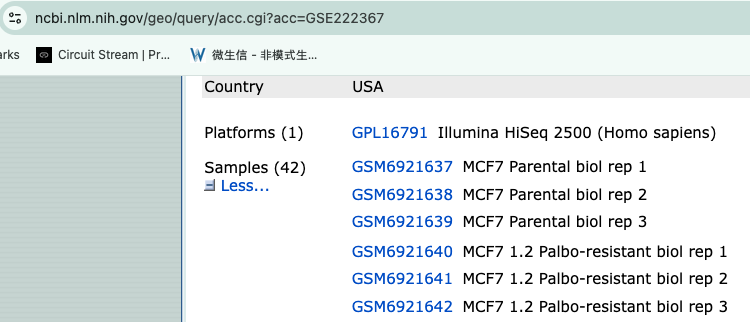

--- 
title: |
  {height=100px}
  
  Cancer Workshop 2026 - Module 8: Pathway Enrichment Analysis
author: "Veronique Voisin"
date: "October 2026"
site: bookdown::bookdown_site
documentclass: book
bibliography: [book.bib, packages.bib]
url: https://veroniquevoisin.github.io/CancerWorkshopBookDown2026/
# cover-image: path to the social sharing image like images/cover.jpg
description: |
  This module will cover how to use differential expression output to generate pathway enrichment results.
link-citations: yes
github-repo: veroniquevoisin/CancerWorkshopBookDown2026
---


**This work is licensed under a [Creative Commons Attribution-ShareAlike 4.0 Unported License](https://creativecommons.org/licenses/by-sa/4.0/deed.en). This means that you are able to copy, share and modify the work, as long as the result is distributed under the same license.**


This module will cover how to use differential expression output to generate pathway enrichment results.

# Presentation of the dataset {-}

* This module is a continuation of the transcriptomics module 6 and we will use the same dataset. This dataset contains bulk RNA-seq data of a model of breast cancer. The gene counts were deposited to the Gene Expression Omnibus (GEO) database under accession ***GSE222367*** and are publicly available.

* RNA was extracted from MCF7, a breast cancer cell line under different conditions: parental cell line and cell line samples resistant to the drugs palbociclib or abemaciclib.

* Biological replicates were available for each condition.

* RNA-seq library was prepared and sequenced using an Illumina HiSeq 2500 sequencer.

* Sequence reads were mapped to the human reference genome (Gencode GRCh38) using TopHat as aligner.

* The BAM files with mapped reads for each sample were sorted and then used as input for HTSeq 0.11.0 in order to generate read count data at the gene level.

* We retrieved the gene counts and performed differential expression analysis using a negative binomial generalized linear model, followed by pathway enrichment analysis.


```{r fig-mychart, echo=FALSE, fig.cap="GEO dataset", out.width="60%"}

```


```{r include=FALSE}
# automatically create a bib database for R packages
knitr::write_bib(c(
  .packages(), 'bookdown', 'knitr', 'rmarkdown'
), 'packages.bib')
```
